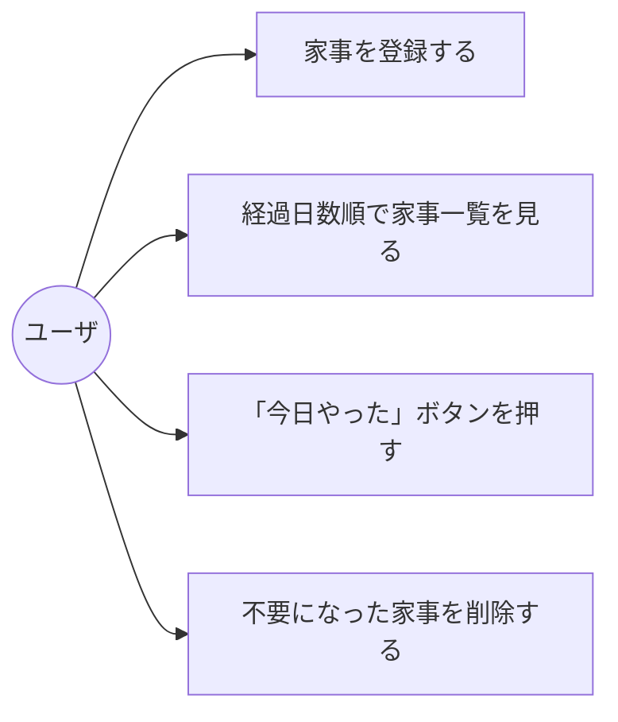
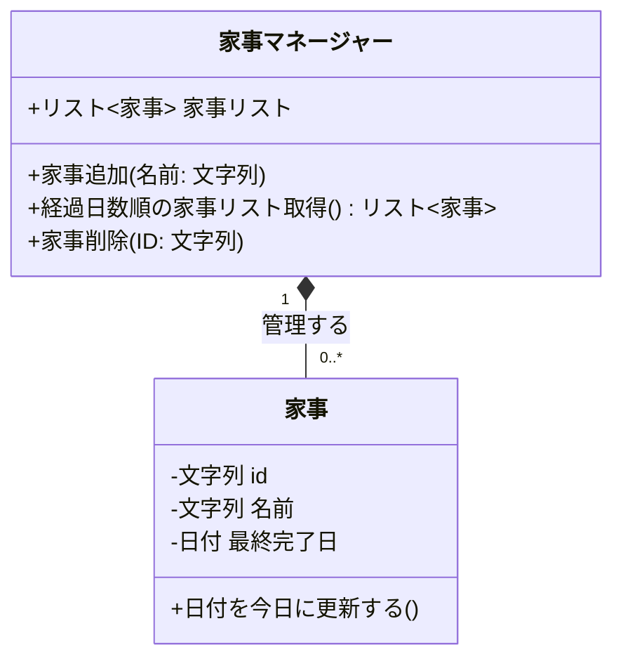
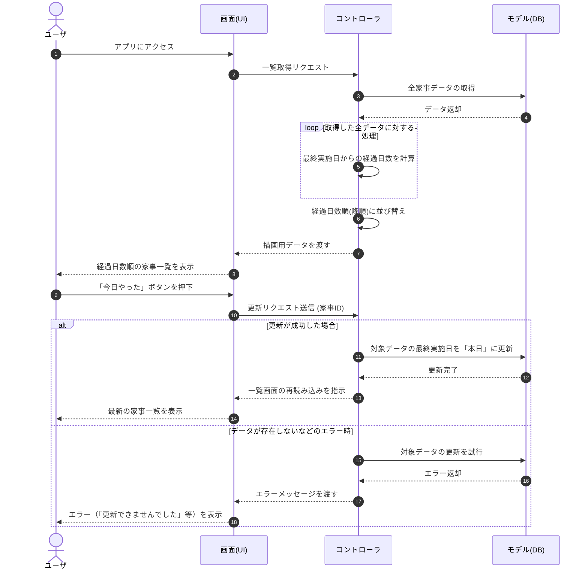
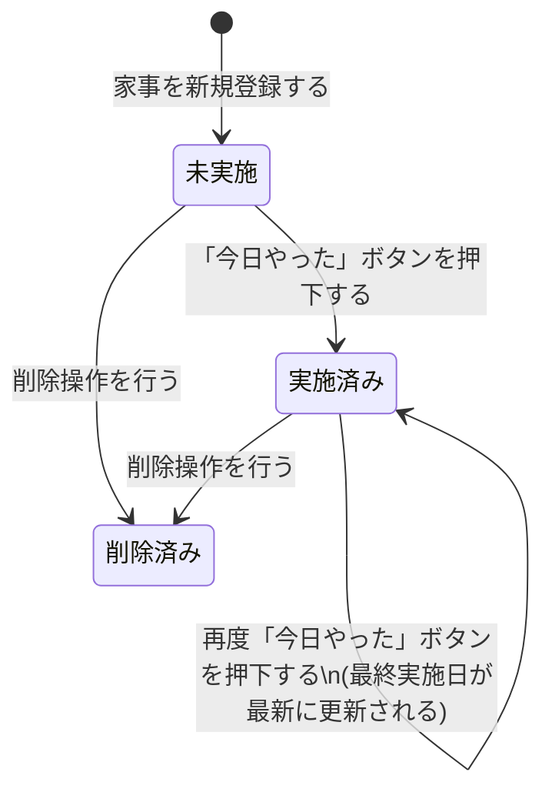

# kaji-kiroku-app
# 名もなき家事・掃除記録アプリ (Chore Tracker)

一人暮らしにおける「名もなき家事」や定期的な掃除の「最後にいつやったか」を記録し、次にやるべき家事を可視化するWebアプリケーションです。

## 設計図 (Architecture Diagrams)

### ユースケース図

### クラス図

### シーケンス図

### 状態遷移図

    
    削除済み --> [*]
