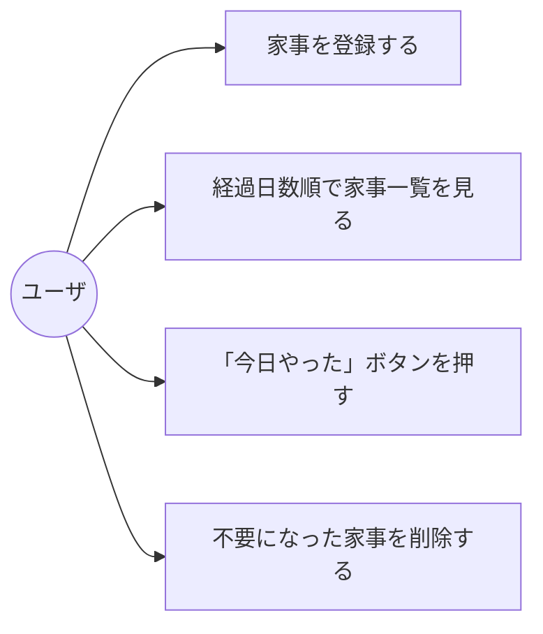
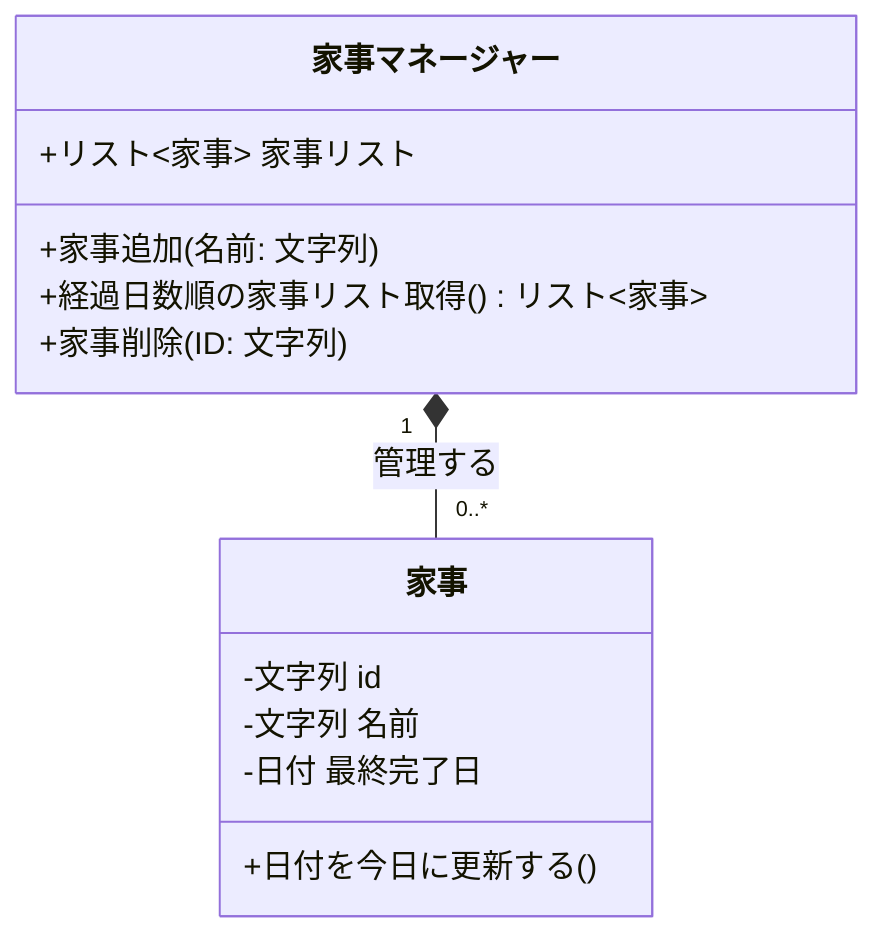
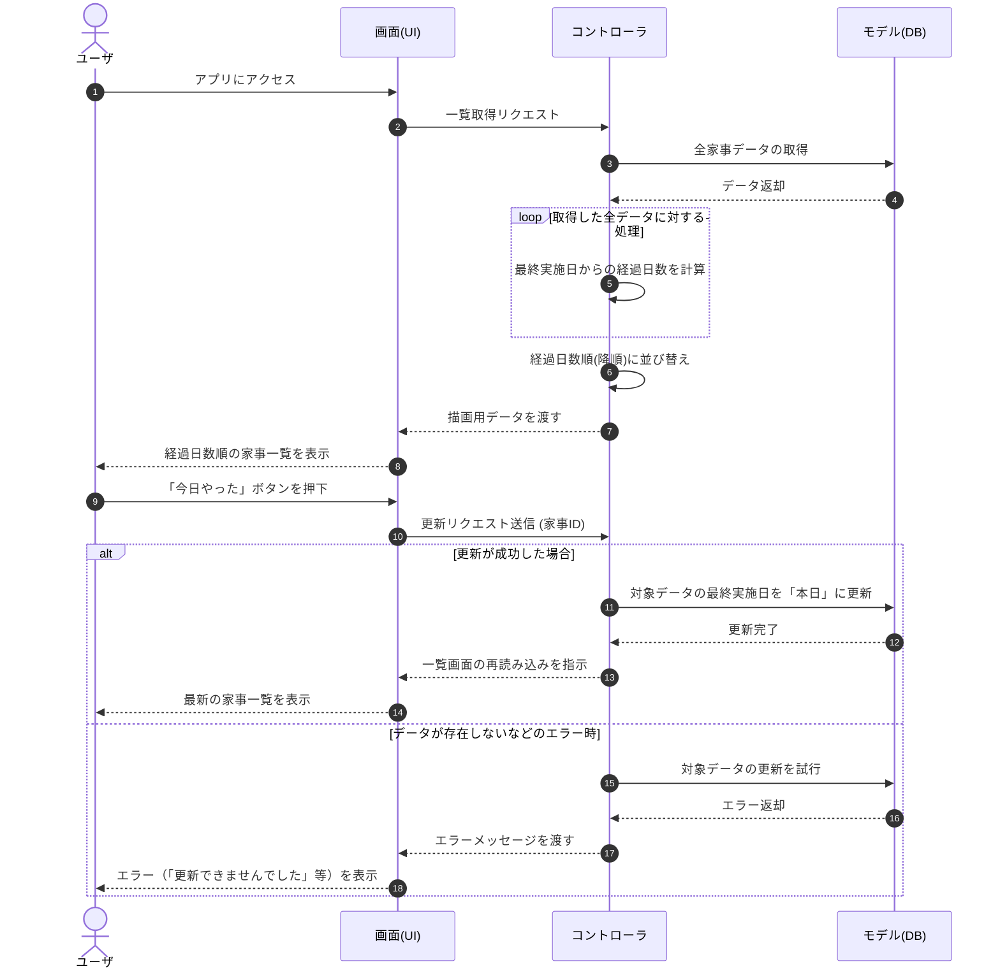
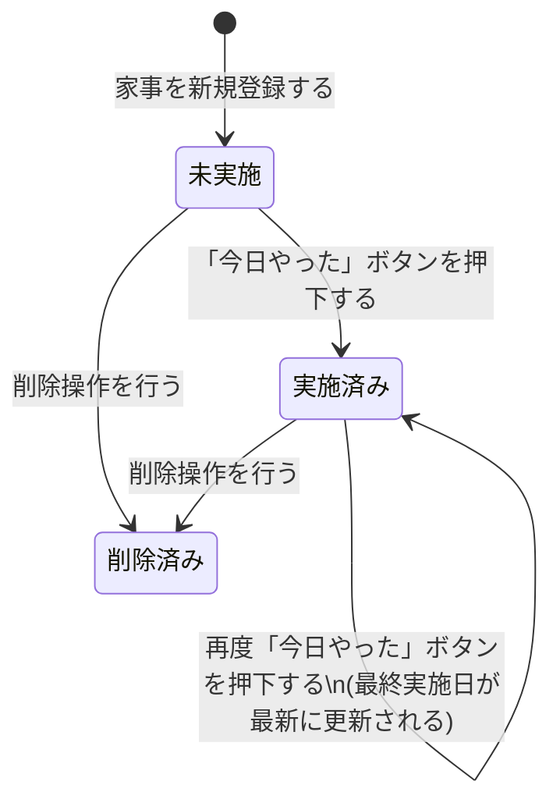

# kaji-kiroku-app
# 名もなき家事・掃除記録アプリ (Chore Tracker)
【目的】名もなき家事・掃除の「最後にいつやったか」記録するWebアプリ

【利用者の入出力】 掃除や家事の実施日を記録し、次回の目安を分かりやすくする

【制約】Python

【受け入れ基準】管理したい家事の登録

前回から日数が経っている順の一覧表示

「今日やった」ボタンで最終実施日を更新

引っ越しなどで不要になった項目の削除

【非目標】ログイン機能は作らない。自動通知
一人暮らしにおける「名もなき家事」や定期的な掃除の「最後にいつやったか」を記録し、次にやるべき家事を可視化するWebアプリケーションです。

## 現在動く機能
- [x] Flaskの初期画面（トップページ）が表示できる
- [x] 上記から行った内容を入力し登録
- [x] 下記に登録した家事の編集
- [x] 今月の日付だけでなく先月と来月の内容を登録できるようにした
- [x] 今月の日付だけでなく先月と来月の内容を登録できるようにした
## 起動方法
python app.py

## 動作確認
1. ターミナル（またはコマンドプロンプト）で `python app.py` を実行
2. ブラウザで http://127.0.0.1:5000 を開く
3. 画面が表示されることを確認
4. 家事内容を登録
5. 今日やったボタンで最終実施日を更新
6. 不要になった項目の削除
7. 先月と来月の内容の確認

## テストケース
| # | テスト対象 | テスト観点(正常/境界/異常) | テスト条件 | テスト手順(1行) | 期待値(1行) | 結果(○/×) |
| --- | --- | --- | --- | --- | --- | --- |
| 1 | トップ画面表示 | 正常系 | 初回アクセス 

 | ブラウザでアプリのURL（/）にアクセスする | カレンダー、グラフ枠、家事入力フォームが正しく表示されること 

 |  |
| 2 | 家事の新規登録 | 正常系 | 必須項目を全て入力 

 | フォームに家事名、カテゴリ、頻度、色、完了日を入力し「登録」を押す 

 | リストとカレンダーに入力した家事が追加されること 

 |  |
| 3 | プリセット入力 | 正常系 | プリセットボタンを使用 

 | 「定番から選ぶ」の「お風呂掃除」ボタンをクリックする 

 | フォームの家事名、カテゴリ、頻度、色が自動で入力されること 

 |  |
| 4 | カレンダーの月移動 | 正常系 | 「次の月」リンク押下 

 | カレンダーヘッダー右側の「次の月 ▶」をクリックする 

 | カレンダーが翌月の表示に切り替わること 

 |  |
| 5 | カレンダーの月移動 | 正常系 | 「前の月」リンク押下 

 | カレンダーヘッダー左側の「◀ 前の月」をクリックする 

 | カレンダーが前月の表示に切り替わること 

 |  |
| 6 | 完了実績の追加 | 正常系 | リストからの完了更新 

 | リスト内の任意の家事で「この日にやった！」ボタンを押す 

 | 経過日数が0日にリセットされ、カレンダーにバッジが追加されること 

 |  |
| 7 | 完了日の過去日指定 | 正常系 | 過去日付での完了登録 

 | リスト内の日付入力欄を過去日に変更し「この日にやった！」を押す 

 | 指定した過去日のカレンダーセルに家事バッジが表示されること 

 |  |
| 8 | 家事の削除 | 正常系 | 登録済み家事の削除 

 | リスト内の任意の家事の「削除」ボタンを押す 

 | リスト、カレンダー、グラフから該当家事のデータが全て消えること 

 |  |
| 9 | カテゴリ絞り込み | 正常系 | 特定カテゴリの選択 

 | 絞り込みボタンの「キッチン」をクリックする 

 | リストに「キッチン」カテゴリの家事のみが表示されること 

 |  |
| 10 | 絞り込み解除 | 正常系 | 「すべて」の選択 

 | 絞り込みボタンの「すべて」をクリックする 

 | 登録されている全カテゴリの家事がリストに表示されること 

 |  |
| 11 | 音声入力 | 正常系 | マイクボタンの使用 

 | 入力欄横の「🎤」を押し、PCマイクに向かって発話する 

 | 認識された音声がテキストとして家事名入力欄に自動入力されること 

 |  |
| 12 | グラフ表示 | 正常系 | 実績データあり 

 | 今月に1件以上の家事完了実績がある状態でトップ画面を見る 

 | 円グラフ（Doughnut chart）がカテゴリ別の色で表示されること 

 |  |
| 13 | ダークモード切替 | 正常系 | テーマ変更ボタン押下 

 | 画面右上の「🌙 ダークモード」ボタンをクリックする 

 | 画面全体の背景が黒系になり、ボタンのテキストが変わること 

 |  |
| 14 | テキストサイズ変更 | 正常系 | 「大」ボタン押下 

 | 文字サイズ設定の「大」ボタンをクリックする 

 | body要素にクラスが追加され、フォントサイズが大きくなること 

 |  |
| 15 | 設定の保存復元 | 正常系 | 画面の再読み込み 

 | ダークモードと文字サイズ「大」にした状態でブラウザをリロードする | ローカルストレージから設定が読み込まれ、変更状態が維持されること 

 |  |
| 16 | 家事の新規登録 | 境界入力 | 家事名の最小文字数 

 | 家事名に「あ」（1文字）のみを入力して「登録」を押す 

 | エラーにならず、「あ」という名前の家事が正常に登録されること 

 |  |
| 17 | 家事の新規登録 | 境界入力 | 頻度の最小値 

 | 「日ごと」の入力欄に「1」を入力して「登録」を押す 

 | 目標日数が1日で登録され、リストの目標表記が1日になること 

 |  |
| 18 | 年越しカレンダー移動 | 境界入力 | 12月から次月へ移動 

 | 12月の表示状態でカレンダーの「次の月 ▶」をクリックする 

 | 翌年の1月カレンダーが正常に表示されること 

 |  |
| 19 | 年越しカレンダー移動 | 境界入力 | 1月から前月へ移動 

 | 1月の表示状態でカレンダーの「◀ 前の月」をクリックする 

 | 前年の12月カレンダーが正常に表示されること 

 |  |
| 20 | グラフ表示 | 境界入力 | 今月の実績データ0件 

 | 今月に完了した家事が1つもない状態でトップ画面を見る 

 | グラフが非表示になり「今月はまだ完了した〜」の文字が出ること 

 |  |
| 21 | カテゴリ絞り込み | 境界入力 | 該当データ0件のカテゴリ 

 | 登録がないカテゴリ（例:玄関・外回り）で絞り込みを行う 

 | リストに「このカテゴリーに登録されている家事はありません。」と表示されること 

 |  |
| 22 | 家事の新規登録 | 異常系 | 空の家事名で送信試行 

 | 家事名を空欄にしたまま、キーボードのEnterを押して送信を試みる | HTMLのrequired属性によりブラウザ側で入力警告が出ること 

 |  |
| 23 | 家事の新規登録 | 異常系 | 不正な頻度で送信試行 

 | 「日ごと」の入力欄に「0」を入力し、登録ボタンを押す 

 | HTMLのmin="1"属性によりブラウザ側でエラー警告が出ること 

 |  |
| 24 | 音声入力 | 異常系 | マイク権限の拒否 

 | ブラウザ設定でマイクをブロックした状態で「🎤」ボタンを押す | エラーイベントが発生し、「音声認識に失敗しました。」と警告が出ること 

 |  |
## 設計図 (Architecture Diagrams)

### ユースケース図

### クラス図

### シーケンス図

### 状態遷移図

    
    削除済み --> [*]
